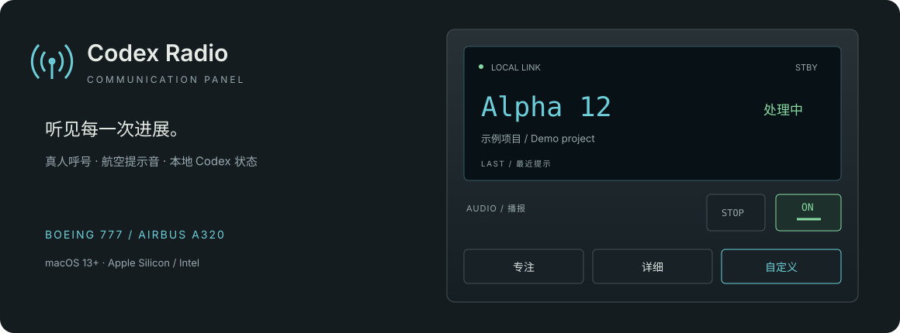

# Codex Radio

一个原生 macOS 菜单栏应用，用**真人项目呼号 + 对话编号 + 状态提示音**播报本机 Codex 的工作状态。

A native macOS menu-bar companion for local Codex activity, with recorded callsigns and selectable Boeing, Airbus and J-11A simulator sound packs.



**macOS 13+ · Apple Silicon / Intel 通用二进制 · Swift / SwiftUI · 本地运行**

[下载最新 DMG](https://github.com/ShunyuanAlex/Codex-Radio/releases/latest) · [更新记录](CHANGELOG.md) · [接入边界](接入边界.txt) · [音源与许可](THIRD_PARTY_NOTICES.md)

## 功能

- 飞机控制面板风格的菜单栏弹窗和设置，分为通用、声音与模式、呼号分配、接入与权限。
- 波音 777、空客 A320、歼-11A 三款声音包，每款八类提示：发送、处理、工具返回、上下文压缩、本轮收尾、等待确认、停止、报错。
- 专注、详细、自定义三种收听模式；呼号与数字紧凑连读，提示音匹配呼号有效电平。
- 最近 7 天本地项目与对话目录，稳定的项目呼号和对话编号；子代理归入父对话。
- 可分别设置登录时启动、启动后自动播报；记住音量、模式和菜单栏显示方式。
- 内置原生事件收集器，新安装不需要 Python、Homebrew 或 Xcode。

三款飞机声音包来自公开的飞行模拟器项目，**不是飞机厂商的官方录音或产品**。歼-11A 使用 FlightGear 的 J-11A / Su-27SK 项目共用座舱素材，经剪辑和节奏编排形成八类应用提示音；未声称是真实歼-11 座舱录音或原机告警语义。Codex Radio 是独立项目，与 OpenAI、Boeing、Airbus、沈飞或素材作者无隶属或背书关系。

## 安装与首次接入

1. 安装并登录 Codex。从 [Releases](https://github.com/ShunyuanAlex/Codex-Radio/releases) 下载 DMG，将 `Codex Radio.app` 拖到 `/Applications`，再从安装位置启动。
2. 首次启动进入「接入与权限」。确认 Codex 数据目录，默认 `~/.codex`；使用自定义 `CODEX_HOME` 时选择实际目录。
3. 阅读本地接入范围，点击「允许读取并安装接入」。Radio 会保留已有 Hooks，并追加缺少的监听。
4. **由你在 Codex 中审查并信任 Hooks。** 可点击「复制 CLI 命令」，在终端运行后输入 `/hooks`，审查 12 项 Radio 定义，再重新打开本地对话。安装配置不等于授予信任。[Codex 官方说明](https://learn.chatgpt.com/docs/hooks)
5. 在本地对话发送一条消息。Radio 显示收到真实事件后，开启播报。手动试听不计入接入验证。

首次使用默认静音、音量 18%。在「通用」中可以独立开启登录自启动与启动后自动播报；新开关默认关闭。升级不会重置旧呼号、编号或 Hooks。

### macOS 首次打开提示

当前发行包使用 **ad-hoc 签名，尚未 Apple 公证**，Gatekeeper 可能拦截。确认来源后，按照 [Apple 官方步骤](https://support.apple.com/en-us/102445)，在尝试打开后进入「系统设置 → 隐私与安全 → 仍要打开」。无需关闭 Gatekeeper，也不提供移除隔离属性的脚本。

## 权限与隐私

- Radio 不需要额外 API Key，不读取 Codex 凭据。
- 不申请辅助功能、屏幕录制、麦克风或完整磁盘访问权限。
- 用户允许后读取本地项目、对话标题、归属、时间等元数据，不打开聊天正文或 transcript。
- Hooks 只保存事件类型、关联标识和明确结果；不保存提示词、工具参数、原始工具输出或上下文摘要。
- 不修改 Codex 信任数据库、`auth.json` 或权限策略；不会自动批准 Codex 操作。
- 事件目录仅当前用户可访问，收集器会清理过期事件。登录项通过 macOS 官方 `SMAppService` 管理，可在系统设置中撤销。

为兼容早期安装，应用标识保持 `local.wingradio.menubar`，用户数据位于 `~/Library/Application Support/WingRadio`。

## 覆盖与已知限制

- 需要支持正式 Hooks 的本地 Codex 版本。云端、远程会话及部分托管工具不保证覆盖。
- 目录读取适配 Codex 当前本地元数据格式，不是稳定公开 API；格式变化可能需要更新应用。
- 「本轮收尾」是结束候选事件，不等于任务验收成功；工具返回也不自动视作成功。
- Intel 已交叉编译，尚未完成 Intel 实机验收。另台 Mac 的首次授权、完整注销／登录流程也尚未验收。
- 个人导入音源仅当前运行有效；内置声音包选择会持久保存。

## 从源码构建

构建需要 macOS、Xcode / Swift 编译工具链，以及 Python 3（用于打包与离线测试）。这些是开发依赖，普通用户运行 DMG 内的应用不需要安装。

```sh
git clone https://github.com/ShunyuanAlex/Codex-Radio.git
cd Codex-Radio
zsh build.sh
```

输出：

- `build/Codex Radio-0.11.2.dmg`
- `build/Codex Radio-0.11.2.zip`
- `build/verification.txt`

构建先在临时目录生成通用应用，验证签名，运行 **118 项无声检查**，再打包。测试覆盖状态队列、编号、音轨、隔离首次安装、事件收集器与启动策略；不会注册真实登录项或修改用户 Hooks。通过这些检查不代表实体设备、主观听感或完整登录流程验收。

`AudioTools/` 包含声音包与呼号片段的处理脚本；原始音源、固定来源提交、处理参数和 SHA-256 一并提供。

## 许可证与贡献

应用源码按 [GPL-2.0](LICENSE) 分发。波音／空客素材保留原 GPL-2.0 许可；真人呼号录音及其改编保留 **CC BY-SA 3.0**。歼-11A 素材按上游 README 的 **GPL-3.0-or-later** 声明分发，并保留原项目附带的 GPL-2.0 文本和作者署名。详见 [第三方来源与改动](THIRD_PARTY_NOTICES.md)。

欢迎通过 Issues 提交问题。请说明 macOS、Codex 与 Radio 版本及复现步骤；发布日志或截图前，请去掉对话标题、项目路径、会话标识和凭据。
